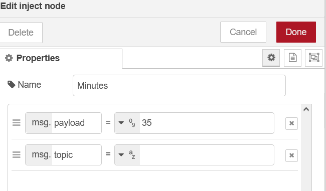
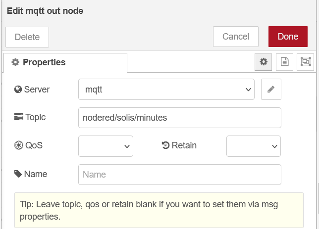
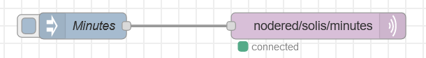
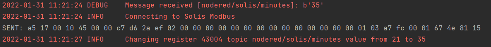

# SolisMod

This is a first attempt to modify Solis inverter settings 
As [SolisMon3](https://github.com/NosIreland/solismon3), this is based on great work by [jmccrohan](https://github.com/jmccrohan/pysolarmanv5)

This script subscribes to MQTT topics and waits for a message. Once something(HomeAssistant, NodeRed) 
publishes to the subscribed topic, the script checks the register assigned to topic and reads the register from 
Solis inverter. If value stored in inverter is not the same as the one in published topic, the new value is sent to inverter.  

## Configuration
### config.py
Modify the values in [config.py](./config/config.py) to match your setup
```
INVERTER_SERIAL = 1234567890  # WiFi stick serial number
INVERTER_IP = "192.168.1.55"  # IP address of inverter
INVERTER_PORT = 8899          # Port number
MQTT_SERVER = "192.168.1.20"  # IP address of MQTT server
MQTT_PORT = 1883              # Port number of MQTT server
MQTT_USER = ""                # MQTT username, leave blank is no user
MQTT_PASS = ""                # MQTT password
DEBUG = True                  # Enable debugging, helpfull to diagnose problems
```

### registers.py
Define the topic and matching register in [registers.py](./config/registers.py) file. `TOPICS_REGS` is a dictionary.
The key(string) a topic you want to subscribe to, the value is a list with single member(integer) which is register you 
want to modify. I made value a list as I may add some more stuff in the future.      
Here is the example: 
`TOPICS_REGS = {"nodered/solis/minutes": [43004]}` 
The script will subscribe to `nodered/solis/minutes` on MQTT server and this will be used to modify holding register `43004`,
which will set inverter clock minutes to desired value.

## Running
Run main.py

### Running in docker
Docker image is provided.   
On your docker host create a folder solismod/config and copy your modified [config.py](config/config.py) 
and [registers.py](config/registers.py) files in there.
```
docker run -it -d --restart unless-stopped --name solismod -v /solismod/config:/solismod/config nosireland/solismod
```

### Docker Compose example
```
version: "3.4"

  solismod:
    image: nosireland/solismod:latest
    container_name: solismod
    restart: always
    mem_limit: 32m
    volumes:
      - /docker/solismod/config:/solismod/config
    logging:
      options:
        max-size: 5m
```

### Testing
You can use different tools to publish to MQTT. Here is a simple example with NodeRed. I will use 
`nodered/solis/minutes` for topic.
1. Change/Add [config.py](config/config.py) and [registers.py](config/registers.py) values
2. Start the script or docker container
3. In NodeRed add Inject and MQTT out nodes. Connect them together
4. Modify Inject node, give it a name('Minutes) and set payload value to the one you want inverter to be changed to(35)   

5. Modify MQTT out node. Select your MQTT server, if you have not configured one click on pen and configure it.   
Enter MQTT topic `nodered/solis/minutes` leave rest blank.

6. Deploy your changes and you should see MQTT out node connected   

7. Once you click on Inject, the value(35) that you have set will be published to MQTT topic `nodered/solis/minutes` and since
the script is subscribed to that topic, it will try to change the register assigned on the inverter.   
You should see the script showing something similar to below      


## Important
This is a very early draft version and things might not work as expected. Feel free to ask questions.